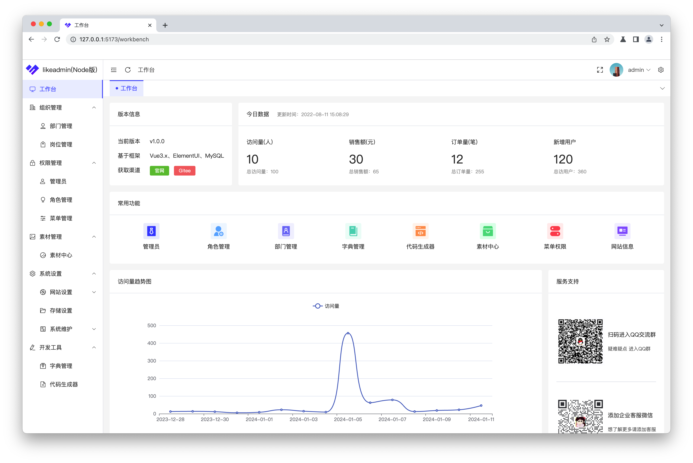

 <h1 align="center">likeadmin（Node）通用管理后台</h1>
<h4 align="center">🚀快速开发、🛠️ 一键生成代码、✅后台多端自适应</h4>

<h4 align="center">鸣谢小伙伴<a href="https://gitee.com/gavinlai">GavinLai</a>参与开发<h4> 

   

##  👀体验后台
### 管理后台
地址：https://node-admin.likeadmin.cn/admin  
账号：admin 密码：123456

### 开发文档
地址：[https://www.likeadmin.cn](https://www.likeadmin.cn "https://www.likeadmin.cn")

## 👨‍💻‍简介
我们希望能够为开源社区做出更多的贡献，推出永久免费开源的likeadmin通用前后端分离管理后台系统。遵循MIT开源许可协议，您可以免费使用，甚至允许把你基于likeadmin开发的软件应用开源、发布、销售。
 
##  🧐进一步了解
### 🧰场景介绍
1.likeadmin已经搭建好前后端分离的底层，包含程序安装、登录、登出、工作台、菜单权限控制、角色、管理员、部门管理、岗位管理、素材管理、网站设置、图库管理等基础功能，无需重复造轮子。更有开发者工具功能，一键生成代码，大大节省开发时间。 
2.可视化系统程序安装界面，可自定义安装数据，开发者可快速扩展发行自己的软件产品。 
3.likeadmin定位为通用的软件系统管理后台，方便开发者快速开发软件系统，文档清晰、代码易懂、简单易用。 
### 🐙后端架构方面
服务端使用node开发，未AI将有更多项目是用node作为服务端语言，node也非常流行。 
### 🐹前端架构方面
#### 后台
1.使用最流性的前后端分离方案typescript、vue3、vite开发，保持了代码的简洁、一致和规范。 
2.后台界面使用element-plus UI框架，简单精美的后台界面，丰富的组件库，方便快速开发，满足各种后台交互。

### 🛠️ 代码生成器
一键生成前后端业务代码，大大提示开发效率。

### ☕️ 参与小伙伴留言
非常感谢您对我的支持！如果您喜欢我的项目并希望支持我，您可以考虑通过以下方式给我买杯咖啡。
 

 
您的支持将鼓励我继续开发和维护这个项目。非常感谢您的慷慨捐赠！